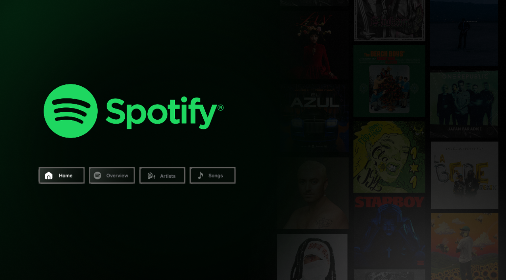
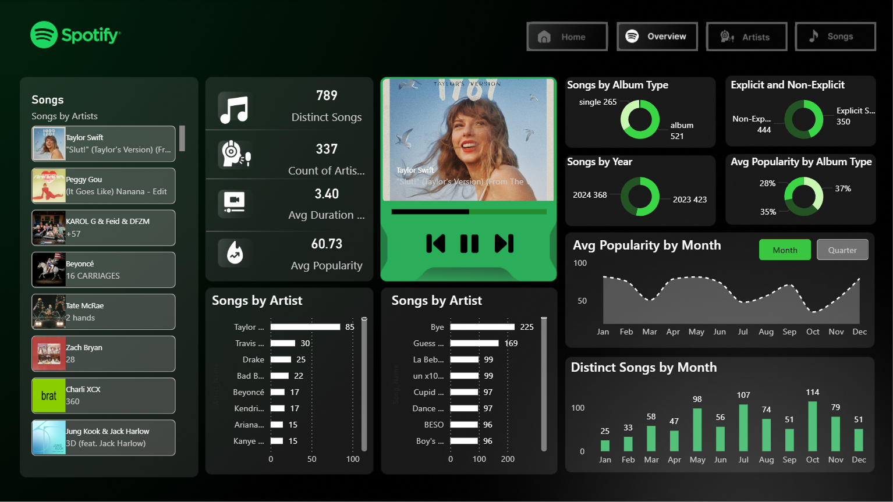
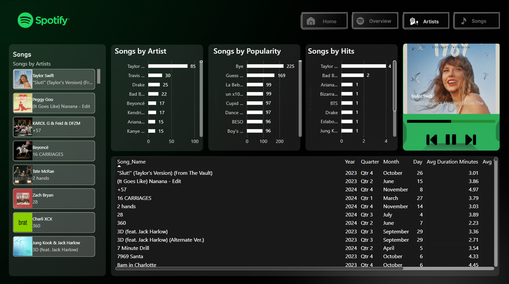

# 🎵 Spotify Global Top 50 Intelligence Dashboard

An end-to-end data analytics project focused on identifying the drivers of global music trends. This dashboard transforms over 27,000 rows of Spotify chart data into actionable insights regarding artist performance and track popularity.

## 🖥️ Dashboard Interface

### Home Screen
The gateway to the analysis, featuring a clean UX designed for seamless navigation between report pages.

### Global Overview
High-level metrics focusing on position trends, popularity distribution, and the impact of explicit vs. clean content on global rankings.

### Artist Deep-Dive
A granular look at artist dominance, tracking which creators consistently hold the top spots and their average popularity metrics over time.

## 📊 Key Features & Analysis
* **Trend Identification:** Analyzed the relationship between `duration_ms` and `popularity` to see if shorter tracks perform better in the Top 50.
* **ETL Process:** Cleaned and formatted a 27k+ row dataset using **Power Query**, handling nulls in album covers and normalizing release dates.
* **DAX Measures:** Developed custom DAX expressions to calculate Year-over-Year (YoY) growth in track popularity.
* **User-Centric Design:** Implemented a custom navigation menu for a "software-as-a-service" (SaaS) feel.

## 🛠️ Tech Stack
* **Data Source:** Spotify Top 50 World (CSV)
* **Analysis & Viz:** Power BI Desktop
* **Documentation:** Markdown

## 📥 How to Use
1. Clone the repository.
2. Open the `.pbix` file in Power BI Desktop.
3. View the raw data in the `/data` folder for further analysis in Excel or SQL.

---
**Author:** [Faisal Alahmadi]  
**Let's Connect:** [https://www.linkedin.com/in/faisal-alahmadi-44145b323/]
